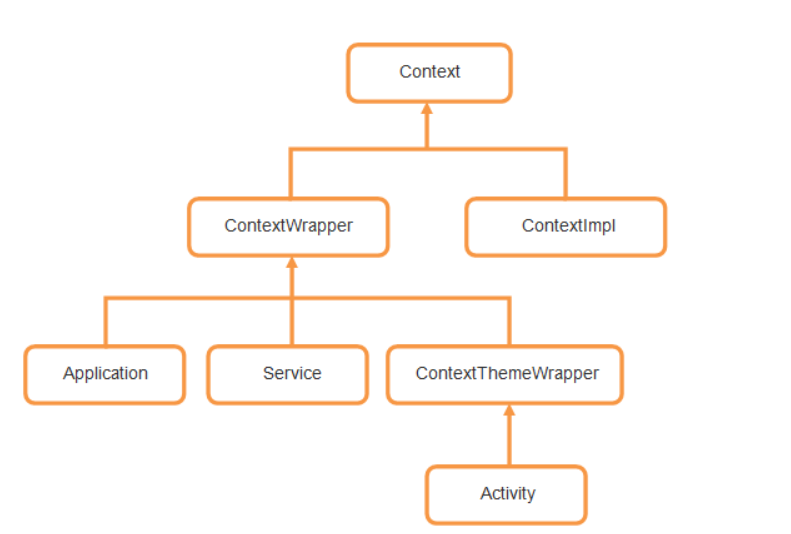

## fragment

* 被activity托管
* 可以和viewmodel绑定，当fragment被销毁，对应的viewmodel也会被销毁

## ViewModel

* 用于托管数据
* 可以和activity和viewmodel绑定

## recyclerView

### 用法

1.设置layoutManager

2.设置Adapter

## 注意

不直接和数据交互

通过Adapter访问数据，只和Adapter交互

拥有ViewHoler的子类，拥有itemView

onBindViewHolder轻量级的话，才可以保证滑动不卡顿

按需创建，onBindViewHolder的调用会少于onCreateViewHolder

Adapter尽量不要插手ViewHolder处理视图的细节，通常的做法，Adapter想要改变视图时候（最常用的时候是初始化的时候），调用viewHolder中更新视图的函数

相比于listView和GridView，对动画的支持更好

# context

* 

但是不是需要context，传入子类就可以，有的时候为了安全性，有的类型的context是不能放的~

一个程序的context数量

`Context数量 = Activity数量 + Service数量 + 1 `(1是application)