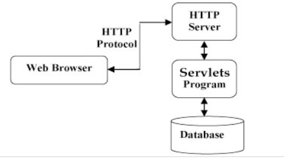

# Spring Boot

## 概念

将Tomact服务器进行内嵌的集成，并且不再需要很多的配置文件，只需要一个配置文件。

## Dependency Injection

目的：降低耦合程度

好处：1.降低耦合程度，一个类不再完全依赖另一个类

​			2.当你进行测试的时候，已经测试好的类不再需要进行测试，你可以将该类虚拟化(就是类似于不存在,创造一个空对象)，而只测试另一部分，例如某一个类依赖于数据库，你无需测试数据库，你只需要测试好你的类就行，因为你依赖的类可能是别人写的，别人已经测试完成了，你无需再进行测试浪费时间。

假设有一个电脑类，里面有一个硬盘类，最初的想法是在里面实例化某一个硬盘，例如三星的硬盘，但是假如未来需要一个其他类型的硬盘，就需要改变创建的方法，进行了硬编码，一个类和另一个类强耦合，所以我们要让另一个类“注入”这个电脑类中，让所有的实现类都继承自硬盘类。

code--java：

```java
class LapTop{
    @Autowired
    HardDrive obj1;
}

@Compotent
class SanXingHardWare implements HardDrive{
    .....
	....
}
```

##  Spring Bean


### @Compotent

* 可以通过getbean(对象名称)获取对象
* 默认每次运行创建对象
* 单例模式
* 参数为在Bean区创建的单例对象的名称

### @Scope(value = "prototype")

* 不再默认创建
* 多次创建的实例不同

### @Autowired

* 自动将两个对象连接在一起
* 适用于一个对象使用了另一个对象作为属性的情况

### @Qulifier("name")

* 将声明的对象和Bean区中名字为name 的对象绑定在一起


## Servlet

### Position in a system



### 作用

* 与服务器交互，获得客户端的数据
* 与数据库交互  处理数据并生成结果

## jsp

* 动态网页开发技术
* 在html文件中内置java代码对信息进行处理