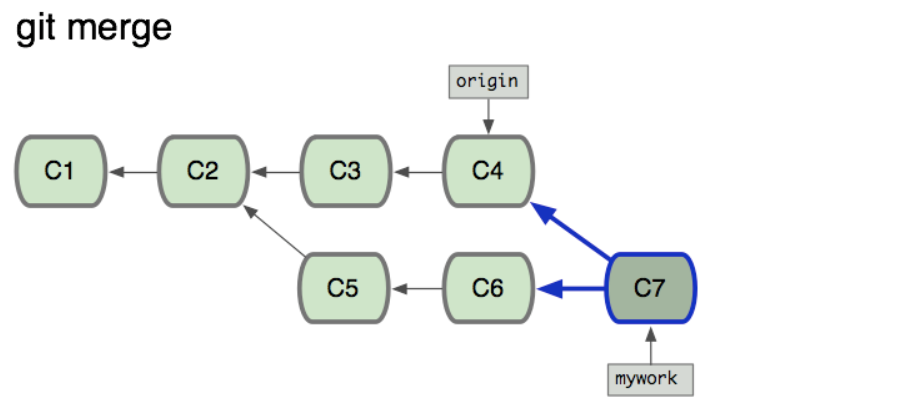
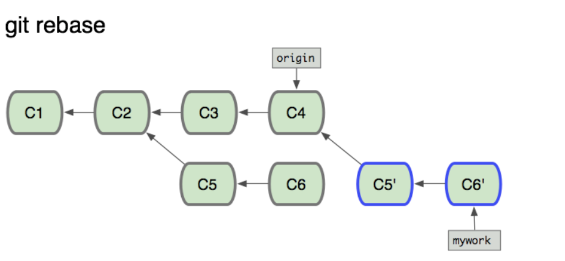

# gitLearn

## 快捷键

crtl+l  快速清屏

## 最常用命令

git restore + 文件名 撤销文件修改

git commit amend -m "message" 修改提交信息

git branch 查看分支--local

git branch -r 远程分支

git branch -a

git branch -d 分支名 删除分支

git checkout - 切换上一个分支

处理冲突：

* git pull

* head 代表本地修改
* 处理好之后再和正常一样add commit push

rebase 就是把一个分支上所有的改变加到某个分支之下

例如：把main分支加到自己的分支之下

git pull --rebase
		处理冲突

git add .

git rebase --continue

git push -f

------------------------------------

merge可以通过普通pull完成

git pull --rebase

-----------------------------

## Saving Changes

### git add

function：将文件提交到staging area(暂存区)

* -A 添加所有文件

* -p 可以决定所有的提交
  * y 同意修改
  * n 忽略修改
  * s 分割修改
  * e 手动修改
  * q 退出

### git commit

ci ---alias

* 其实是提交staging area中的修改到本地
* 是本地git仓库的重要节点
* git是将文件进行直接提交，不是提交修改
* 直接输入会打开文本编辑器让你编辑提交的提示
* -m  "commit message"最常用
* --amend 会打开编辑器，让你编辑提示信息，这个参数的意义是将此次提交不创建新的提交，而是覆盖前一次的。
* 提交规范 第一行用50个字符以内说明提交内容，之后下面空一行，进行详细信息的书写。

### git push

Git可以进行本地修改

push才会提交到远端

` git push - u origin `

stash:存储改变的地方(存储还没有commit的)

### git diff

* 伴随使用  git statu/git log
* 后面可以添加文件，diff范围将限制在文件之中
* --cached/--staged 对比缓存区和现在的内容有什么不同
* 普通对比是对比现在和之前的文件有什么不同--均未进入缓存区
* 传入两次的commit的ID来对比这两次内容的不同
* git diff main new_branch ./diff_test.txt 判断和其他branch上的文件有什么不同
* git diff branch1 other-feature-branch 不同branch对比

### git stash

* 暂存uncommitted changes,包括未add 的改变
* 暂存之后会将内容变回之前的样子，可以理解为将你进行的改变给“吃”掉了，等你需要的时候再“吐出来”
* git stash pop 将刚刚吃掉的吐出来，肚子里没了
* git stash apply  将刚刚吃掉的吐出来，肚子里还有副本
* 不会存储新建立的文件，也不会存储Ignore文件

* git stash list 查看所有stash
* git stash save 描述性文本 
* git stash pop stash@{2} 指定执行哪本版本的stash
*  git stash branch add-stylesheet stash@{1} 创建一个新的分支并将stash应用于这个分支上面
* git stash drop stash@{1}/git stash clear 清理stash
* -all  stash .gitgnore和untracked文件

### 原理未查看

### git show

* 加Hash值，查看某次commit

###  . gitnore

* **/logs 用双星号来匹配logs下的所谓文件

* **/logs/debug.log  两个星号可以理解为任意路径

* *.log 匹配任何以log结尾的文件

* *.log  !important.log 匹配所有以log结尾的，但是不会匹配important.log  感叹号要在通配符之后

* 同时满足时候，**后面的规则会覆盖前面的规则**

* /debug.log 只会忽略根目录下的debug.log文件

* debug.log 匹配所有名字为debug.log，不限制文件夹

* debug?.log  debug[0-9].log debug[01].log debug[!01].log  用法同正则表达式

* logs 忽略目录和logs目录下的东西

* logs/  只忽略logs目录下的东西

* logs/ !logs/importrant.log 后一项忽略不会发挥作用

* logs/debug.log 只会取消根目录下的logs/debug.log

* 用 # 可以添加注释

* 用 \ 来进行转义

* .git/info/exclude 可以定义个人的gitgnore规则

* $ touch ~/.gitignore
  $ git config --global core.excludesFile ~/.gitignore

  这两条命令 创建全局的gitgnore 适用于该系统下的所有仓库

* $ echo debug.log >> .gitignore

  $ git rm --cached debug.log
  rm 'debug.log'

  $ git commit -m "Start ignoring debug.log"

  删除debug.log，并开始对其进行gitgnore，只删除了在仓库中的该文件，本地依然可见，**去除--cached参数**，本地也被删除

* git add -f filename  -f代表强制提交

* git check-ignore -v filename 查看filename在哪里被ignore了,filename可以任意传入，不需要在该仓库中的文件

  output:\<file containing the pattern> : \<line number of the pattern> :\<pattern>    \<file name>

## Inspecting  a respository 查看状态

### git status

* 忽略gitgnore中的文件状态
* 查看 the working directory and the staging area

### git log

* 打印出**commit**日志
* --pretty=oneline  / --online 更改输出模式为一行(输出的commit的id不一样，前者的更全面)
* -n \<limit> 显示limit条数据
* --author="\<pattern>"  查看某位用户的提交 
* --grep="\<pattern>"   查找commit message符合pattern的提交
* git log \<file>  查看某个文件的提交历史
* git log \<since>..\<until>  查看某段提交记录，参数可以为a commit ID, a branch name, HEAD
* git log HEAD~3 输出HEAD往前三个版本的所有commit
*  -p 显示详细的commit信息
*  --branches=* 打印所有分支的commit信息，默认只打印当前branch的信息

### git tag

* 标记发布版本
* git tag \<tagname> 创建一个名字为tagname的tag
* 有lightweight和annotated两种，后者包含更多的元数据，前者一般用在local，类似于书签，后者一般用在public时候，标记重要节点，上面的命令创建的是lightweight的
* git tag -a \<tagname> annotated tag ----会拉起编辑器
* git tag -a v1.4 -m "my version 1.4" 一步到位
* git tag 列出所有tag
* 后在加参数  可加commit的ID 作为tag的地址，默认tag到HEAD节点
* -f 重新更新某个tag
* git checkout tagname 这将会进入某个tag
* git tag -d tagname 删除某个tag
* git push origin tagname 显示push tag

### git blame

* 用于查看每个提交的具体内容，谁提交的，为什么提交
* git blame filename 必须加文件名 显示该文件的修改历史
* git blame -e README.md 显示邮件而不是显示用户名

## undoing changes 撤销修改

### git restore

* 直接加文件名字 撤销修改

### git checkout

* 加版本号 会将仓库状态暂时回归到某个版本，你可以随意进行操作，之后需要git stash存储你的修改，再git checkout mian 回到仓库的当前状态，main也可以替换为其他想要切换的分支名字

*  git  checkout -b branch_name 在当前切换到的状态下创建新的分支

  

### git revert

* HEAD 创建一个新的commit，作用是将HEAD指向的commit删除，也就是回退一个版本

* 后面必须添加参数

* 添加某个commit的ref代表下次commit只**单独撤销那一次commit**

* --no-edit 不拉起文本编辑器

  

### git reset

* 重置commit或者staged snapshot，也就是清空缓存区

* 会直接删除，不会保存副本

* --hard commitID  直接回退到commitID版本、

* 但是push的时候，会报错，提示你有missing commit

* **只能将之前的版本全部删除**

* --mixed  --soft  --hard

  

### git clean

-----

* 默认必须 -f   这种删除是无法恢复的
* 删除对象为untracked file----也就是新建立的，没有被add过的文件
* -n  将显示哪些被删除，应该在强制删除之前使用这条命令
* 不会递归执行
* -d 将会包括根目录下的文件夹
* git clean -f \<path> 删除指定的路径
* 默认不清除.gitgnore文件
* -x 清除.gitgnore中的文件
* -i 开启交互模式，出现WhatNow，输入6，即可查看帮助

### git branch

* 默认显示当前的branch

* -a  显示所有的branch

  

## The three Tree of Git

### The Working directory

* 也就是对本地的文件的修改

* 用git status查看，会显示modified---用红色显示

### Staging index

* tracking Working Directory changes
* 一般跟踪git add的内容
* 查看命令:git ls-files -s
* -s 代表stage
* git add 之后再查看为绿色
* 用-s查看SHA映射变了

### Commit history

* 

# Git Lab

## 名词解释

### issue

就是给仓库的建议，可以被任何人创建，然后合作者进行修改，每个问题有单独的线程，issue也可以进行分类或者指定给某个人

### branch

一个分支，不在主线程上工作，完事之后可以合并到主线程，每一个分支应该有单独的任务，并且为了简洁，每个分支存活的时间很短。

# 常见问题汇总

# Please commit your changes or stash them before you merge

1. git stash
2. git pull
3. git stash pop

第一步将内容暂存

第二步将云端的拉下来

第三步暂存内容通过栈管理，这个是弹出最顶部的