# matlab知识点

## 常用函数

end 代表子数组的下标最大值

format格式化

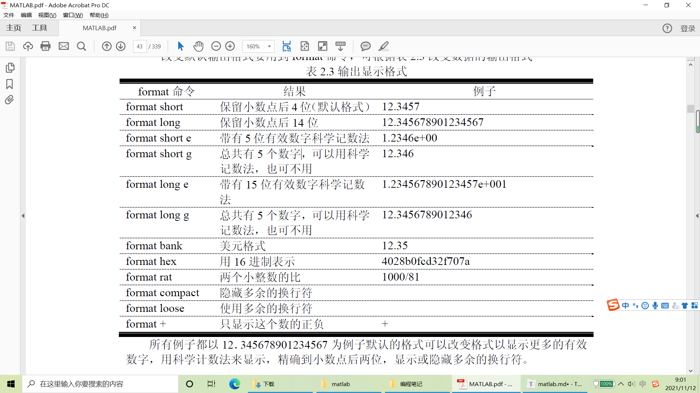

fprintf

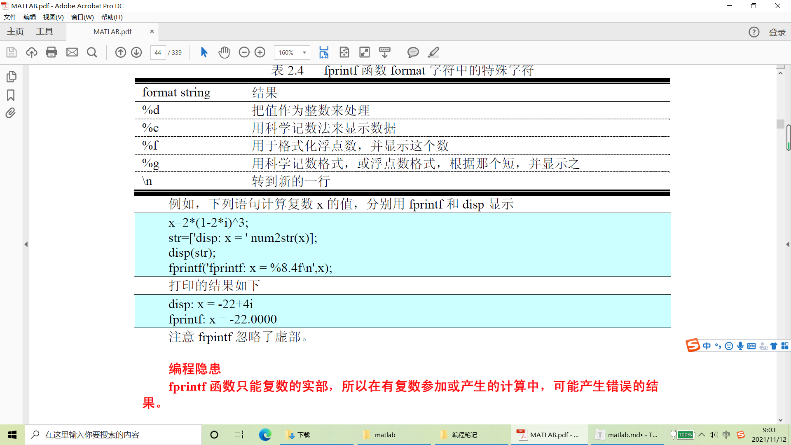

save

* 默认保存为mat文件，只有matlab可以使用
* 可以加 -ascii 保存可以被其他程序读取(后缀变为dat，代表其他文件也可以读取)
* save filename.mat 可加参数代表保存某些参数，不加代表保存所有数据

数组的乘除操作

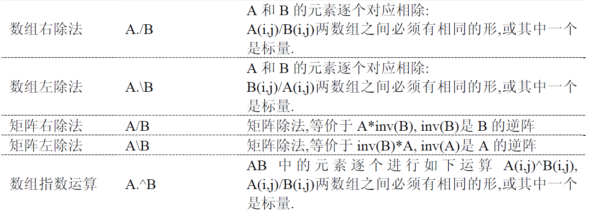

maxval = max ([1 -5 6 -3])

[maxval index] = max ([1 -5 6 -3])

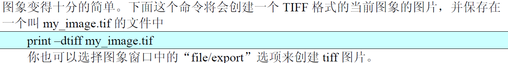

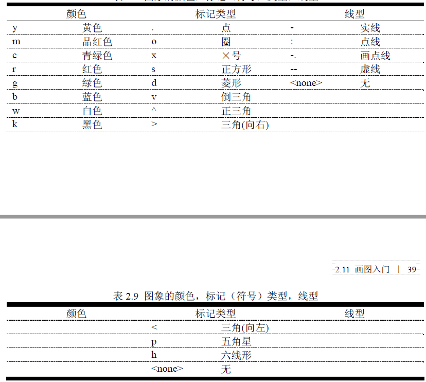

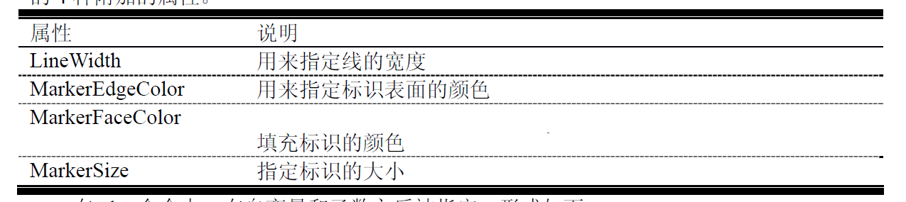

legend

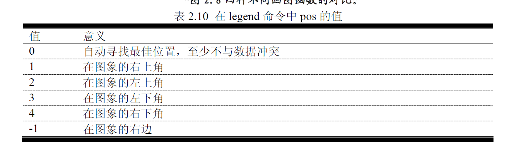

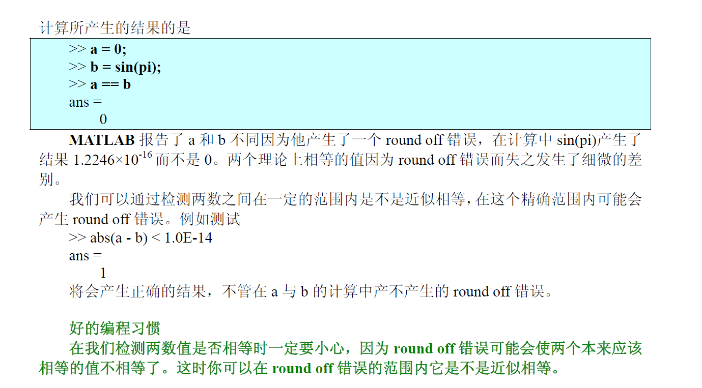

axis

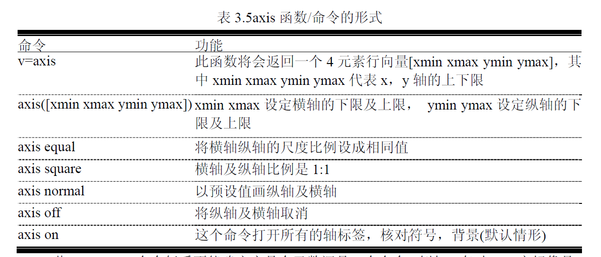

linspace(a,b,c)

* a起始值
* b终止值
* 一共多少个数

rand(n)

* 随机生成n*n的矩阵
* 值满足0-1的正态分布

size

* 返回尺寸

## 特殊符号

eps  变量epsilon的简写，代表计算机能识别的两数之间的最小数

stream modifiers

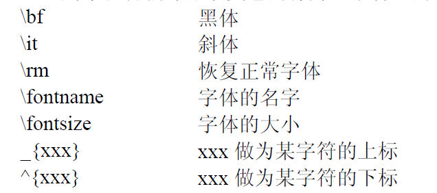

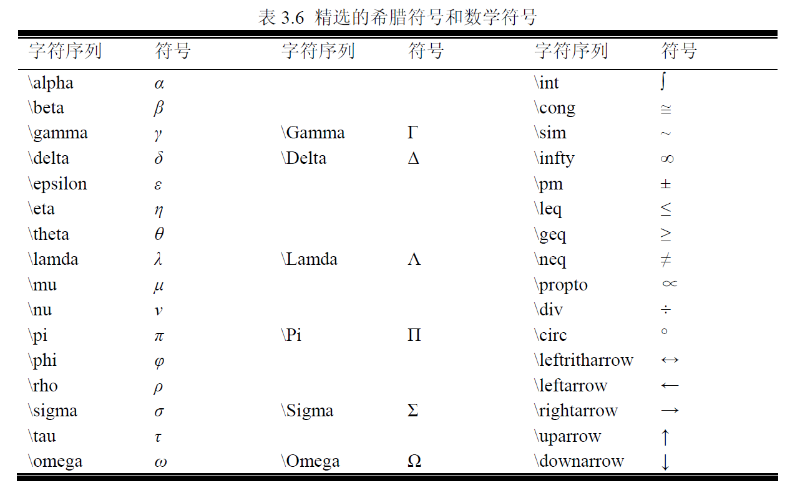

对于函数的检查

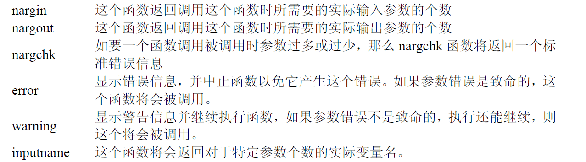

复数操作

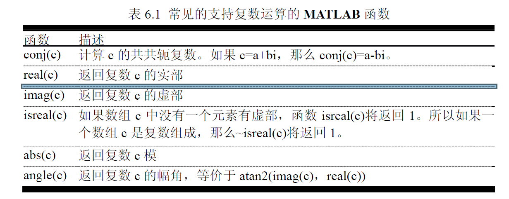

end

y=data(end,3)-->data数据的最后一行第三列的数据

**直接写数字是按照列走的！！！**

~ 代表占位符 用于提取别的值

## 文件标注

```matlab
%Script file: calc_roots.m
%
% Purpose:
% This program solves for the roots of a quadratic equation
% of the form a*x^2 + b*x + c = 0. It calculates the answers
% regardless of the type of roots that the equation possesses.
%
% Record of revisions:
% Date Programmer Description of change
% ====== =========== ================
% 12/04/98 S. J. Chapman Original code
%
% Define variables:
% a --Coefficient of x^2 term of equation
% b --Coefficient of x term of equation
% c --Constant term of equation
% discriminant --Discriminant of the equation
% imag_part --Imag part of equation (for complex roots)
% real_part --Real part of equation (for complex roots)
% x1 --First solution of equation (for real roots)
% x2 --Second solution of equation (for real roots)
% Prompt the user for the coefficients of the equation
```

## 调试

## 特殊操作

mask---逻辑值可以当mask，只有部分数据参与运算

doc 函数名 打开文档

hold on/off

plot(sample,v1,'ro-',"LineWidth",4)

### 语法

```matlab
if condition1 
   code 
elseif condition2
   code 
end 
```


 