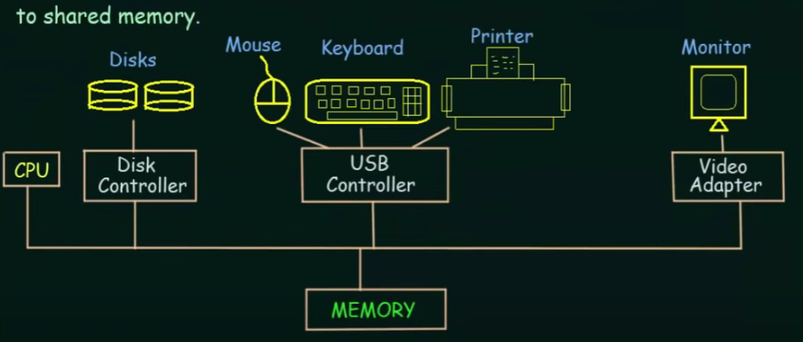

# introduction

## 什么是操作系统？

* 用来管理计算机硬件
* 作为用户和硬件的中介
* 为应用程序提供基本的运行环境

## 基本结构

* 一台电脑上通常由一个或多个CPU（中央处理单元）
* 通过不同的Controller和Adapter可以访问不同的硬件设备
* 所有这些通过BUS连接，就是中间那个线
* 访问相同的内存

## 基本概念

1. Boottrap program
   * 当计算机启动时第一个调用的程序
   * 存储在ROM(read only memory) 只读存储器
   * 负责将OS kernnel 加载到memory中
2. Interrupt
   * 硬件发出信号给CPU
   * 通过BUS来完成这个传输
   * 任何时候都可能发生
   * CPU立刻停止当前的工作，根据传入的指令执行别的操作，完事之后继续当前的工作
3. System Call（Monitor call）
   * 也是中断的一种
   * 通常由软件引发

## 存储器

寄存区 register

缓存 cache

主存储器 main memory   举例：RAM(random access memory) 随机访问存储器

-------------------------------------

磁盘 disk

* 分界线之上的，断电会失去存储的信息，以下的不会失去
* 越往上，访问速度越快，价格越高，往下容量越大
* 任何程序执行时候都要先读取到RAM中

