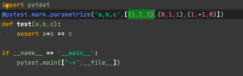

# 测试

## 库

pytest

## 注意

### 说明

* 函数名以`test`开头
* 类名以`Test`开头
* 类内部方法也以`test`开头
* 类中不能有构造方法
* 使用`assert`进行断言
* 脚本名需要以`test`开头
* 作用于函数，也可以作用于类

### pytest.main

* 以数组作为参数

* -s 将print语句的结果输出
* -v 以详细信息显示每条用例执行结果
* -q 以极简的形式显示测试结果
* -k 通过关键字匹配脚本、函数名、类名、方法名-- 指的是要执行的测试中，有这个关键字，可以理解为路径中有这个
* -x 有失败用例，测试停止
* --maxfail=n  失败用例达到n时，停止测试
* -m 对用例进行标记，执行被标记的用例
  * 1项目根目录下新建 `pytest.ini`
  * 2.在`pytest.ini`添加标记
  * 3使用装饰棋标记测试`@pytest.mark.a`
  * 4执行测试时，使用-m 标记 执行指定的标记用例

### 命令行执行

* py.test 参数 脚本

* python -m pytest 参数 脚本

### 跳过用例

* @pytest.mark.skip(reason=xxxx),无条件跳过某用例
* @pytest.mark.skipif(condition,reason=xxxx) 有条件跳过

### 参数化

* @pytest.mark.parametrize('参数1，参数2....',值)

  * 参数，与被装饰的函数形参相同
  * 值，传递给参数的数据，多个数据封装在元组中
  * 多条测试用例，放在list中

  

  

### 前置/后置

* 前置后置就是跑测试用例之前和之后执行的代码

* 模块级，作用范围在模块中
  * setup_module()  前置
  * teardown_module() 后置
  
* 函数级别，每个测试函数执行前后执行
    * setup_function()  前置
    * teardown_function() 后置
    
* 类级别，在类中定义
    * setup_class()  前置
    * teardown_class() 后置
    
* 方法级，类似于函数级
	* setup_method()/setup()  前置
	* teardown_method()/teardown() 后置
### fixture

* 创建 `@pytest.fixture([name,scope,autouse])`

  * name--fixture  名称，默认为被装饰的函数的名称
  * scope 指定fixture的作用范围，module、class、function、session、package，默认为function
  * autouse 设置为True，实现自动调用fixture，不用在作为参数传入测试函数，如果传入测试函数，用刚刚指定的name作为参数即可
  * yield用于返回对象
  * yield之后代码为后置的
  * variable=name of fixture 可以完成接收fixture的返回值
  
* 全局的fixture
  
  * 项目下创建`conftest.py`,文件名称不可更改，必须是这个
  * 在该文件中实现fixture
  
## 网络协议基础

### 三层

* 表示层
* 业务逻辑层
* 数据访问层

