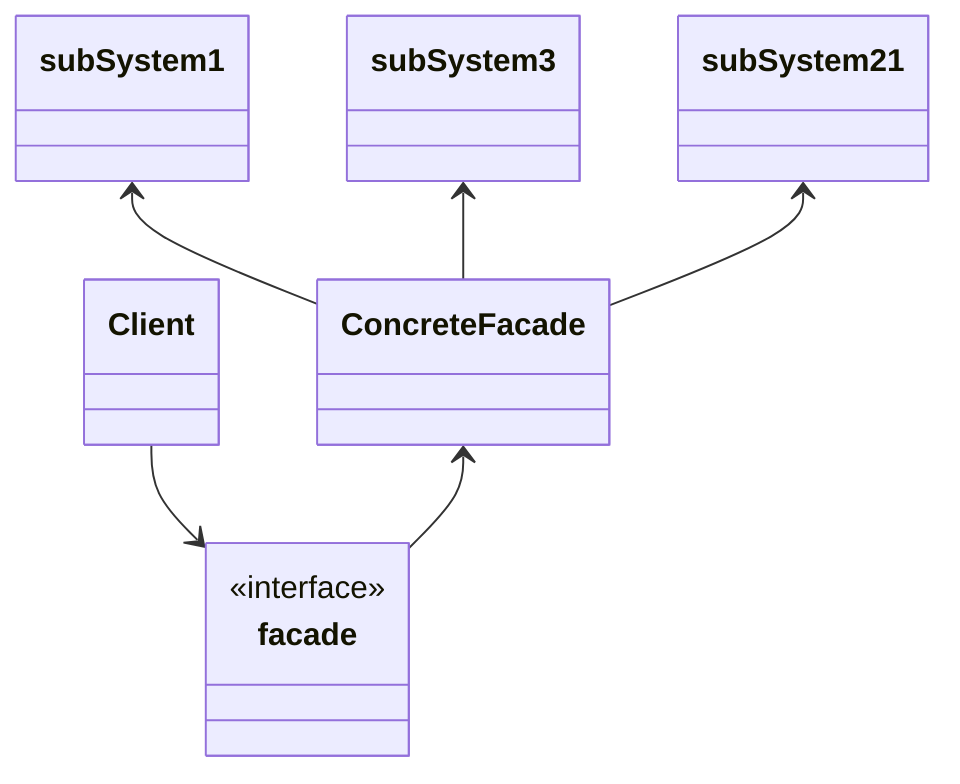
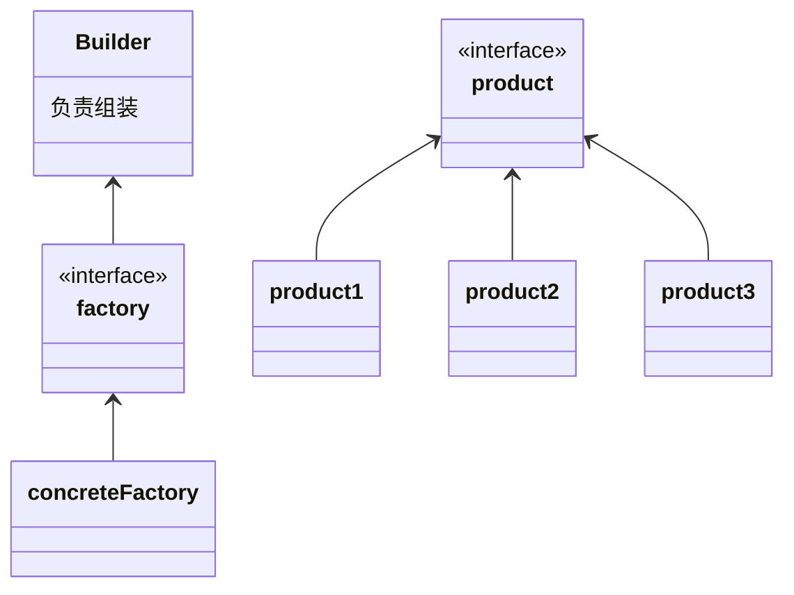

# 外观 facade

## 一、例子
你做了个系统，想要给别人用，别人自然会调用你的接口，但是他可能调用多个子模块，代码量会很大，所以你可以加将几个功能封装成他想要的功能提供给他。

## 二、类图

``` mermaid
classDiagram
Client-->facade
class facade
<<interface>> facade
ConcreteFacade<--facade
subSystem1<--ConcreteFacade
subSystem3<--ConcreteFacade
subSystem21<--ConcreteFacade
```

```mermaid
classDiagram
factory<--concreteFactory
<<interface>> factory
product<--product1
<<interface>> product
product<--product2
product<--product3
Builder<--factory
class Builder{
	负责组装
}
```

