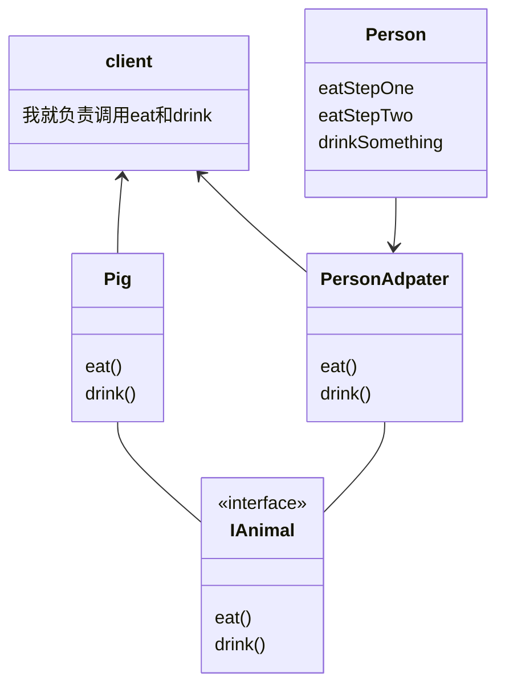
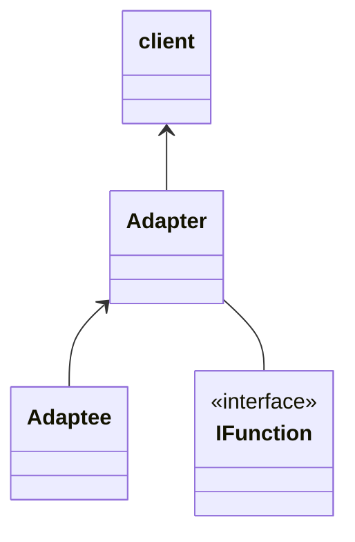

# 适配器模式

一张图说明问题

将一种接口映射成另一种接口

## 举例子

有两个，一个Person，一个Pig，一个接口IAnimal，里面有两个方法，eat和drink，

pig规规矩矩实现这个接口，

那么创建一头猪并且调用这两个方法

创建一个Person类，人比较特殊，吃东西非得分两步，并且有自己喝东西的方法。

假设并不想改变client中的调用（也就是还想通过eat和drink来调用Person类中的方法），就需要创建适配器--- PersonAdapter类

该类继承Person并且实现IAnimal接口

当client想要调用Person中的方法时，只需要改变创建的那里，代码如下：

该程序类图

